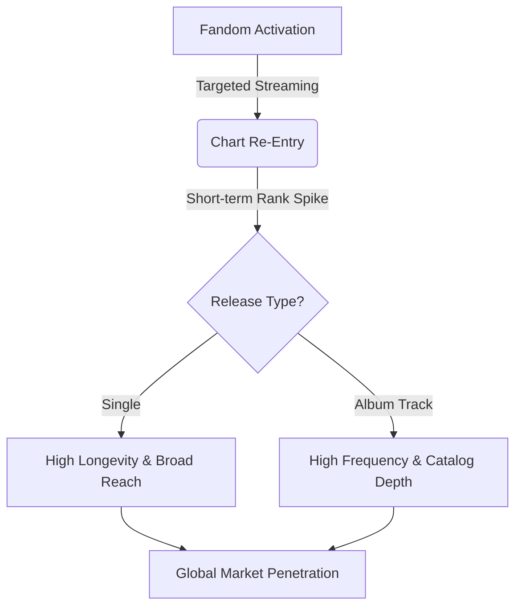

# Executive Summary: Capitalizing on Fandom Dynamics in the Digital Music Economy

**Prepared for:** Ministry of Culture, Sports and Tourism (MCST), Korea Creative Content Agency (KOCCA), and Executive Board of Atlantic Recording Corporation  
**Context:** Policy and Strategic Briefing on the South Korean Music Market (May 2024 – November 2025)

---

## Executive Overview

South Korea’s music industry—specifically the K-Pop sector—stands as a premier global case study in digital exports, cultural soft power (*Hallyu*), and high-intensity consumer engagement. Using daily playlist tracking data from Spotify South Korea Top 50 spanning **555 days (27,750 validated records)**, this briefing outlines how fandom-driven streaming behaviors shape chart dynamics, and details policy recommendations to sustain South Korea’s leadership in the global digital music economy.

Our empirical modeling tracked **1,429 chart runs** and **888 distinct song re-entries** (comeback surges), proving that success in this market relies on *recurring momentum bursts* rather than traditional linear decay.

---

## Key Strategic Findings

### 1. Fandom Streaming as a Market Driver
Chart activity in South Korea is highly non-linear. The median time a song remains off the chart before being pushed back into the Top 50 is **only 3.0 days**. This indicates an active, high-frequency cycle where fans deploy targeted streaming campaigns to reactivate songs. 
- *Policy Impact*: Streaming is no longer a passive consumption metric; it is an active form of cultural participation and digital labor.

### 2. The Content Rating Filter
Explicit content faces severe structural friction in the domestic market:
- **Clean songs** average **1.91 re-entries** per track and retain chart presence for **56.7 days**.
- **Explicit songs** average only **0.45 re-entries** and drop off the chart after **27.0 days**.
This disparity is driven by a combination of public broadcasting regulations, playlist curation guidelines, and a cultural preference for clean versions that are safe for multi-generational fandom streaming.

### 3. B-Side Catalog Reactivation
While singles maintain the longest continuous chart presence (58.0 days average), album B-sides exhibit higher re-entry frequency (1.71 vs. 1.60). Fandoms consistently stream entire album catalogs during anniversaries and promotional milestones.
- *Commercial Value*: This deep-catalog reactivation represents a significant, under-monetized asset class for labels.

---

## Policy and Strategic Recommendations

### For Government Stakeholders (MCST / KOCCA)

1. **Modernize Chart Tracking Frameworks**  
   Transition from measuring "unique listeners" exclusively to a weighted model that recognizes both unique reach (longevity) and repeat engagement (re-entries). This will provide a more accurate representation of cultural exports and digital consumption.
   
2. **Incentivize Clean-Edit Production for Global Distribution**  
   Provide export grants and subsidies to domestic agencies that produce high-quality clean edits and alternative versions (e.g. acoustic remixes, instrumental packages) of tracks, directly aligning with global playlist standards.

3. **Support Fandom-Driven Cultural Spaces**  
   Recognize the value of fan-driven digital platforms. Establish intellectual property protections for fan-created content (remixes, video edits) that act as primary drivers for catalog reactivation.

### For Industry Executives (Atlantic Recording Corporation)

1. **Establish a Localized "South Korea Release Protocol"**  
   Mandate that all priority releases pitched to South Korean streaming platforms contain clean edits and alternative versions. Do not rely on explicit cuts for marketing.
   
2. **Redistribute Marketing Spend to "Phase 2" Campaigns**  
   Instead of front-loading marketing budgets for initial release weeks, reserve 30% of capital to support catalog re-activation around Day 30, specifically targeting B-side album tracks that align with natural fandom streaming spikes.
